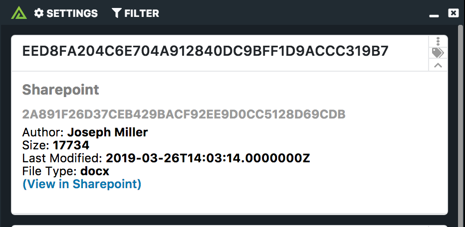

# Polarity sharepoint Integration

The Polarity Sharepoint integration allows freeform text searching of your Sharepoint instance.

|  |
|---|
|*Style Guide*|

## sharepoint Integration Options

### Host

The top level domain of the Sharepoint instance to use for queries.

### Authentication Host

The host to use for authenticating the user, usually this should be allowed to default.

### Client ID

The Client ID to use for authentication.

### Client Secret

The Client Secret associated with the Client ID.

### Tenant ID

The Tenant ID of the Sharepoint instance.

### Subsite

Limit search to only a subsite.  This field should be only the subsite name, _not_ the full path.  This field is optional and can be left blank.

### Blacklist Domains

Comma delimited list of domains that you do not want to lookup.

### Domain Black List Regex

Domains that match the given regex will not be looked up (if blank, no domains will be black listed).

### IP Black List Regex

IPs that match the given regex will not be looked up (if blank, no IPs will be black listed).

## Polarity

Polarity is a memory-augmentation platform that improves and accelerates analyst decision making.  For more information about the Polarity platform please see: 

https://polarity.io/
